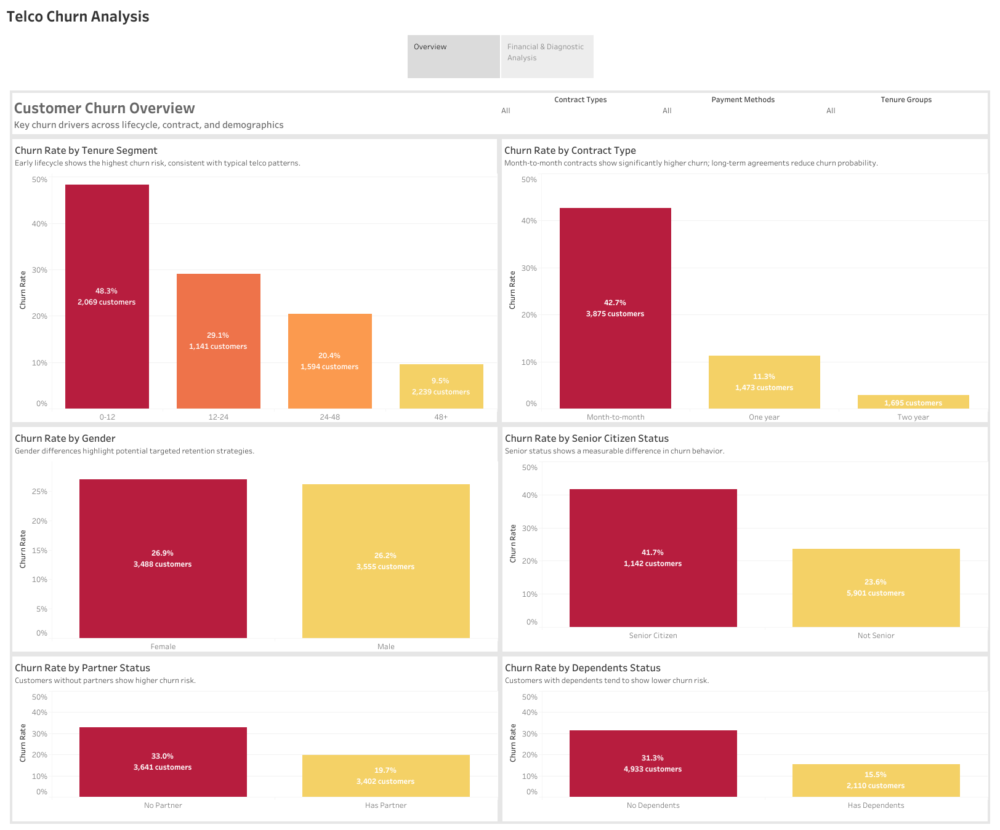
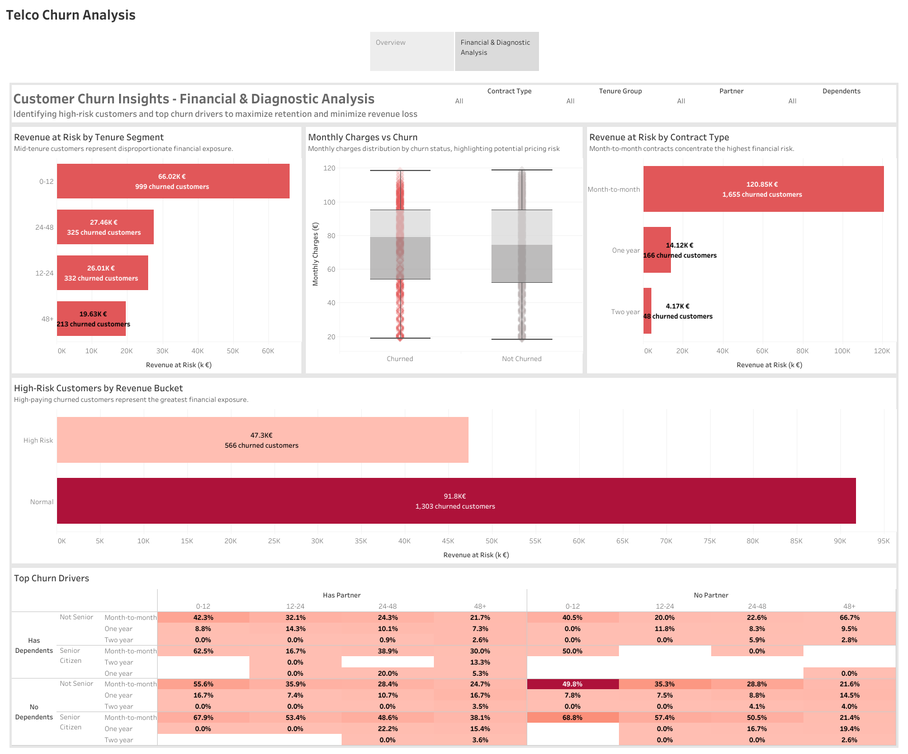

# Telco Churn Analysis

## Executive Summary

This project analyzes customer churn behavior for a telecommunications company using exploratory data analysis, SQL-based feature engineering, and interactive Tableau visualizations.

The analysis identifies key churn drivers across tenure, contract type, and customer demographics, and quantifies the associated revenue at risk. Results show that churn is strongly concentrated among early-tenure customers and those on month-to-month contracts, with a significant financial impact driven by higher-charging customer segments.

The final output is delivered as an interactive Tableau Story combining descriptive churn analysis with financial diagnostics, enabling data-driven retention strategy and prioritization.

## Project Overview
This project analyzes customer churn for a telecommunications company, focusing on **patterns, high-risk revenue segments, and top churn drivers**. It combines **Python EDA**, **SQL analytics**, and **interactive Tableau dashboards** for end-to-end insights.

**Key Objectives:**
- Explore churn trends across customer segments
- Identify high-risk revenue segments
- Determine top drivers of churn
- Provide actionable insights for customer retention

---

## Dataset
- Source: Telco customer data (synthetic/realistic)  
- Key columns:
  - `customerid`, `gender`, `seniorcitizen`, `partner`, `dependents`
  - `tenure`, `contract`, `paymentmethod`, `monthlycharges`, `totalcharges`
  - `churn_flag`, `revenue_at_risk`, `high_risk_customers`, etc.
- Tables:
  - `customer_raw`: raw imported & cleaned dataset
  - `customer_analytics`: derived metrics and calculated fields for dashboards

---

## Methodology

### 1. Python EDA
- Libraries: `pandas`, `numpy`, `matplotlib`, `seaborn`
- Steps:
  - Univariate and bivariate analysis
  - Data cleaning and type corrections
  - Feature engineering (tenure groups, revenue at risk, flags)

### 2. SQL Analytics
- Created `customer_analytics` table
- Calculated:
  - Churn rate per segment
  - Revenue at risk per customer group
  - Aggregated KPIs for dashboards
- Advanced queries:
  - Grouping by tenure, contract, revenue bucket
  - Window functions for ranking and diagnostics

### 3. Tableau Dashboards
| Dashboard | Focus | Sheets | Key Metrics |
|-----------|-------|-------|-------------|
| **Dashboard 1 — Churn Overview** | Descriptive churn patterns | Churn by Tenure, Contract, Gender, Seniority, Partner, Dependents | Counts, % churn |
| **Dashboard 2 — Customer Churn Insights** | Financial impact & diagnostics | Revenue at Risk by Tenure, Revenue at Risk by Contract, Monthly Charges vs Churn, High-Risk Customers by Revenue Bucket, Top Churn Drivers | Revenue at Risk, Churn Rate, High-Risk Customers |

The analysis is presented as an interactive Tableau Story composed of two dashboards.  
Each dashboard focuses on a different analytical objective.

### Dashboard 1 — Churn Overview

**Objective:**  
Provide a descriptive overview of customer churn patterns across tenure, contract type, and customer demographics.

---

### Dashboard 2 — Financial Impact & Diagnostics

**Objective:**  
Quantify revenue at risk from churned customers and identify high-risk segments and key churn drivers to support retention strategy.

---

## Key Insights
- High-paying customers represent the **largest financial risk** if they churn  
- Churn rates are highest among **short-tenure, month-to-month contract customers**  
- Partnered or dependent customers generally churn less  
- Insights provide actionable guidance for **targeted retention and revenue protection**

---

## Deliverables
- Python notebooks: **EDA & Data Cleaning**
- SQL scripts: **Analytics & KPI calculations**
- Tableau dashboards: **Interactive and portfolio-ready**
- Portfolio screenshots: **consistent 1600×1200 resolution**
- README.md summarizing approach, methodology, and insights

---

## Skills Demonstrated
- **Python:** data wrangling, EDA, visualization  
- **SQL:** aggregation, window functions, KPI computation  
- **Tableau:** dashboard design, calculated fields, interactivity  
- **Data storytelling:** linking metrics to business impact  

---

## Business Recommendations

Based on the churn and revenue-at-risk analysis, the following actions are recommended:

1. **Prioritize long-term contract migration**  
   Customers on month-to-month contracts show the highest churn rates and account for a disproportionate share of revenue at risk. Targeted incentives to migrate these customers to annual or two-year contracts could significantly reduce churn.

2. **Focus retention efforts on early-tenure customers**  
   Churn is highest within the first 0–12 months. Proactive onboarding, early satisfaction checks, and targeted offers during this period may improve long-term retention.

3. **Monitor high-charge customers closely**  
   Customers with higher monthly charges contribute more to revenue at risk when churned. Early warning indicators should be established for this segment to trigger retention actions.

4. **Leverage partner and dependent signals**  
   Customers without partners or dependents exhibit higher churn tendencies. These attributes can be used as supporting signals in churn risk scoring models.

5. **Align retention strategy with financial impact**  
   Retention initiatives should be prioritized based not only on churn likelihood but also on estimated revenue at risk to maximize business impact.

